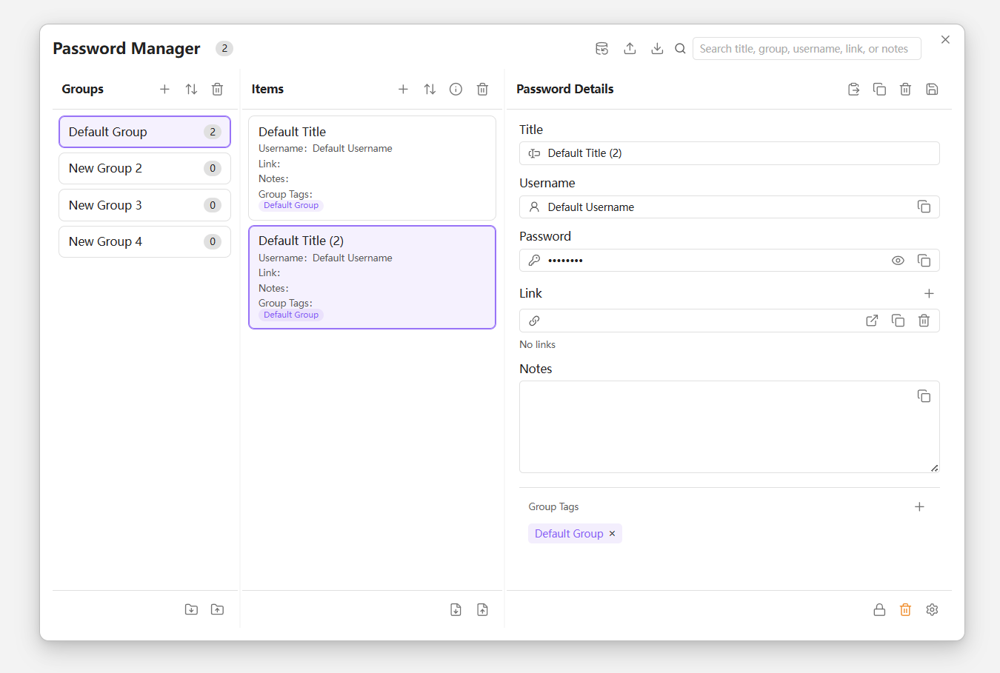

# Obsidian Password Manager

[English README](./README.md)

> 在 Obsidian 中轻量管理账号、密码与链接，支持加密、备份、回收站与导入导出。



## 📖 简介

**Obsidian Password Manager** 是一款用于 Obsidian 的轻量密码管理插件，适合在笔记库中集中保存和整理日常使用的账号密码信息。

插件使用 JSON 结构存储数据，并提供三栏管理界面，便于在分组、条目和详情之间快速切换。对于常见的网站账号、软件登录信息、简单密钥记录等场景，这种方式更轻量，也更方便和笔记一起管理。

## ✨ 特性

- 🔐 **加密存储** – 支持对整个密码库进行本地加密存储，解锁方式和重新校验时机可配置。
- 📂 **分组管理** – 自定义分组（默认分组、网站密钥、个人档案等），便于分类。
- 🔍 **快速检索** – 支持按标题、用户名、链接、备注或分组名实时搜索。
- 💾 **备份与恢复** – 一键导出所有数据为 JSON 快照，随时恢复。
- 📝 **自动导出 Markdown** – 支持将完整密码库自动同步导出到指定 Markdown 文件，便于只读查看、整理或配合笔记工作流使用。
- 📤 **导入 / 导出** – 支持 Markdown / JSON 格式，方便迁移或与其他工具协作。
- 🗑️ **回收站** – 删除的条目暂存回收站，可还原或彻底清除。

## 🚀 安装

### 手动安装（BRAT）

1. 安装 [BRAT](https://github.com/TfTHacker/obsidian-brat) 插件。
2. 在 BRAT 设置中添加：`https://github.com/yourusername/obsidian-password-manager`。
3. 启用插件。

### 本地手动安装

- 下载最新 `main.js`, `manifest.json`, `styles.css` 到库目录 `.obsidian/plugins/obsidian-password-manager/`。
- 重启 Obsidian 并启用插件。

## 🔒 安全说明


- 本插件**不会**通过网络传输任何数据，所有信息均保存在本地 Obsidian Vault 中。
- 当前加密实现基于浏览器原生 Web Crypto API：使用 **PBKDF2 + SHA-256** 从用户输入的加密密码派生密钥，迭代次数为 **250000**；实际数据使用 **AES-GCM 256 位** 进行加密，并为每次加密生成独立的 `salt` 与 `iv`。
- 启用加密后，插件会对整个密码库 `data.json` 进行加密存储；密码校验则通过单独的 verifier 密文完成，而不是保存可逆明文。
- 如果使用 Git 同步 Vault，请确保 `.gitignore` 排除加密密钥文件（若有），或接受 JSON 文件中密文被提交。

> 如果你需要更完整的专业密码管理能力，这个插件更适合作为轻量记录工具，而不是完全替代专业密码管理器。

## 📝 开发与贡献

- 项目地址：[https://github.com/yourusername/obsidian-password-manager](https://github.com/yourusername/obsidian-password-manager)
- 欢迎提交 Issue、PR 或建议。
- 本地开发：

```bash
git clone ...
npm install
npm run dev
```

## 👏 鸣谢

Developed by [PandaNocturne](https://github.com/PandaNocturne).

## 📄 许可证

[MIT](LICENSE)
